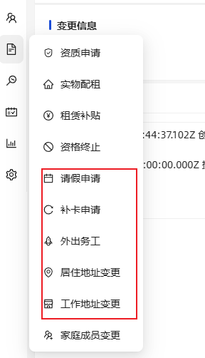

首页 ---留那些指标  样式富有层次感  
第一项 代办 （请假 审批） 明显的卡片 需要做的 最醒目

第二项 快捷入口

第三项 指标  已激活居民数量 未激活居民数量
           实物配置  租赁补贴  资格终止  

打卡趋势   预计打卡 超时还未打卡
 打卡总数  工作打卡 居住打卡 已打卡 未打卡  

预警  类型
  预警总数  已读 未读  

           
打卡记录 成功未成功放在行为日志中

消息中心  代办消息  业务通知 预警消息

// 居民  打卡记录 请假  补卡  外出务工  居中变更  工作变更  都删掉

// 家庭  没有 工作信息 个人收入 成员变更   资质申请  实物配租  租赁补贴  实物配置  租赁补贴  资质终止 

//资质申请 中间位置放 申请那些表格数据

// 实物配置 新增弹框增加地址  删除项目    中间位置  家庭那些信息    资质的资料    租赁补贴 同理

 这几项中间位置不展示 
、
//家庭成员 放原来家庭的信息 

//考勤打卡 中间位置放 人脸 和地图tab

//预警列表 预警处置放在消息中

考勤方案  考勤规则（先保持）  

//表格颜色要调整

//左右靠边 全部改为圆角  

// 审批流程 新建和设计  重新优化

小程序工作台 增加一个消息列表 在下面

首页改成指引  配色在优化一下 参考支付宝

打卡引导式  位置页面 让是家庭还是打工打卡  获取当前定位 下一步 进行围栏校验 然后再拉起活体检验  然后 360 视频上传   提交打卡 

审批流设计 

小程序整体页面设计
我的改为消息中心
工作台顶部改为我的加上名称 点击进去设置页面

圆角改到分页组件

我的代办  代办消息 业务通知 预警消息   消息中心去掉

本周打卡率 
